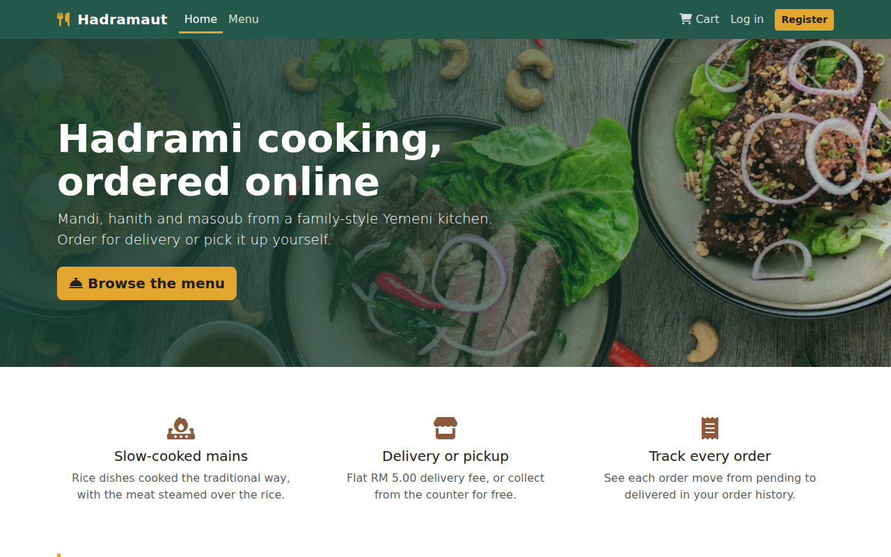
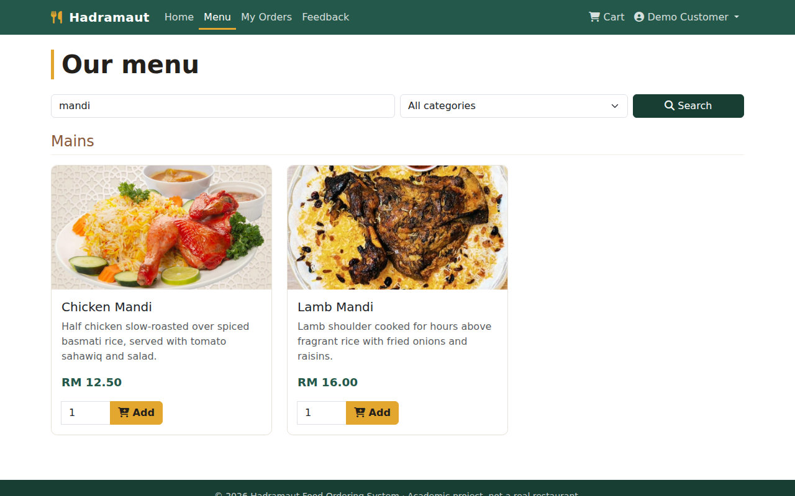
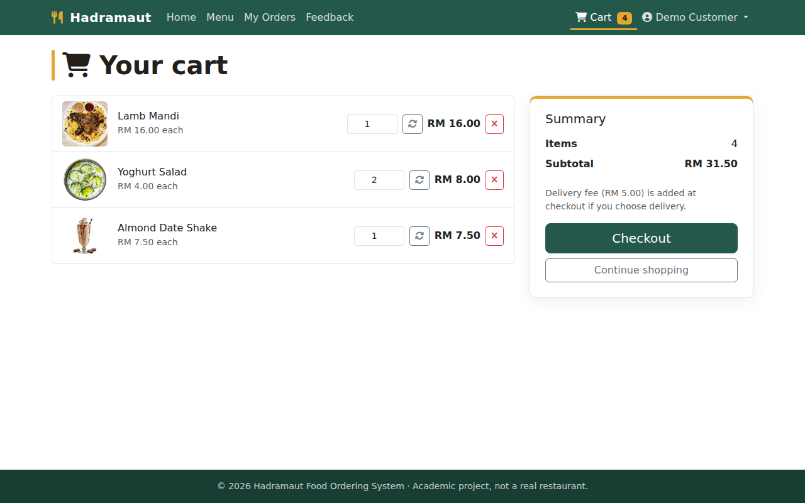
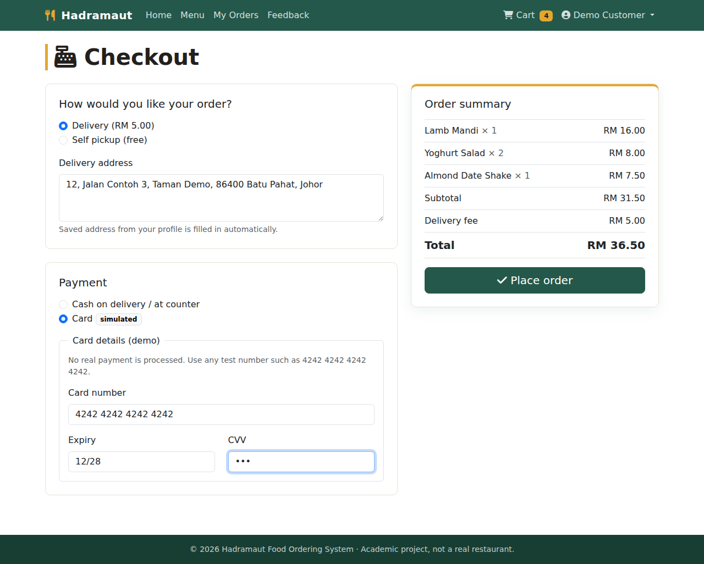
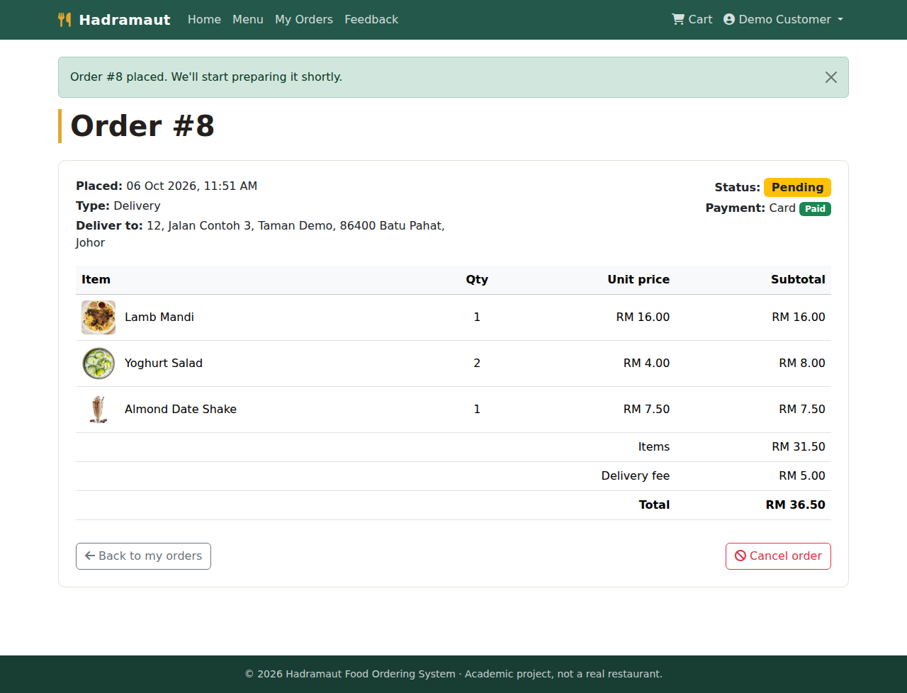
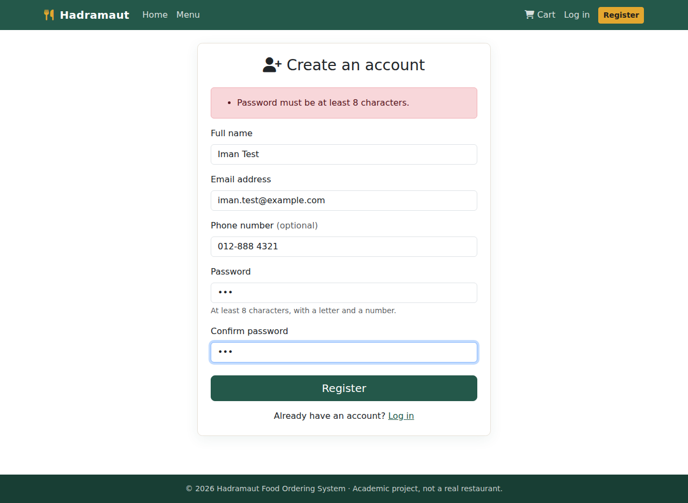
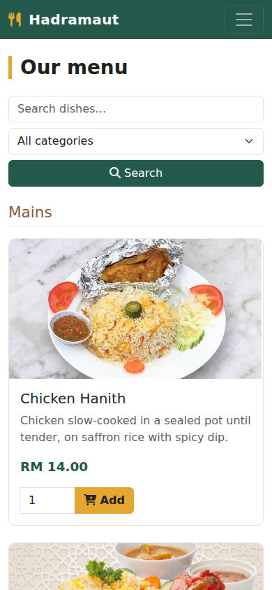
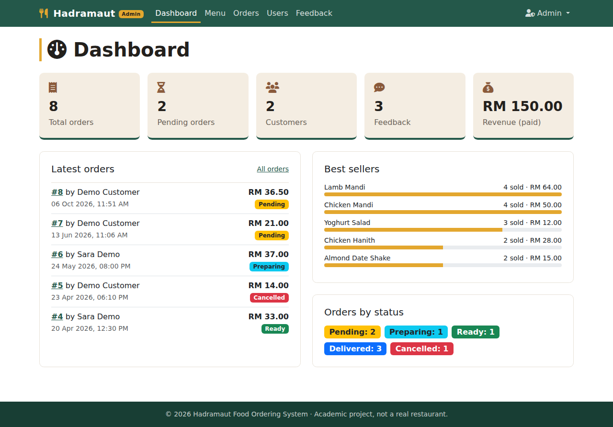
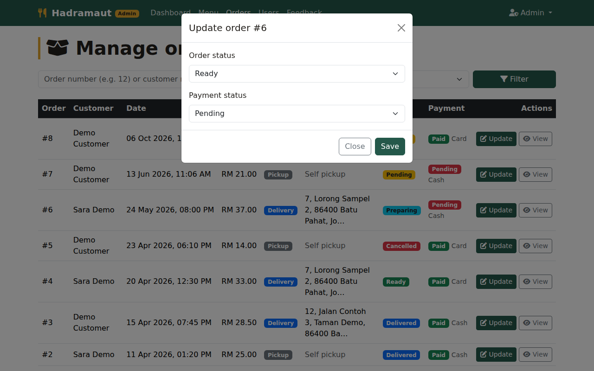
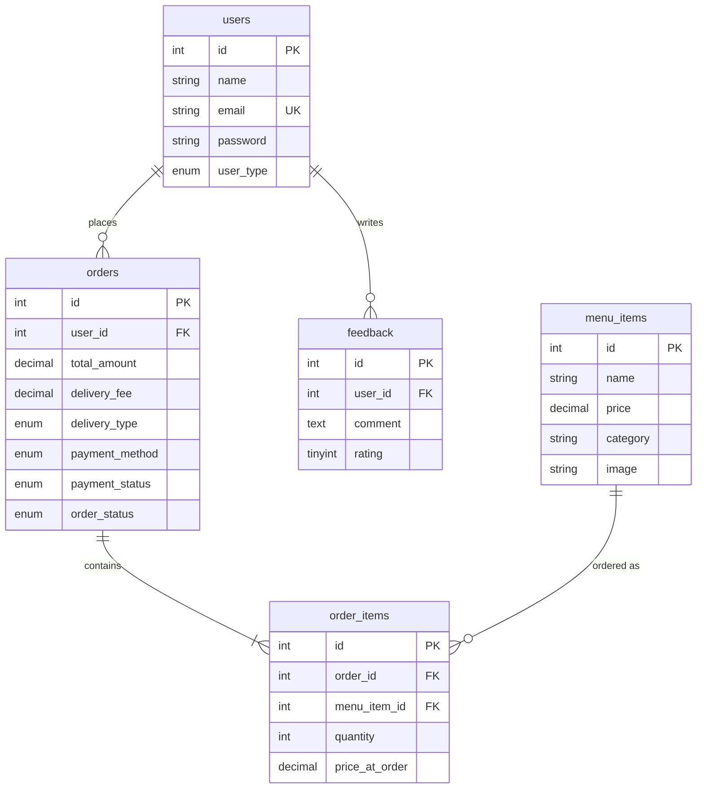

# Hadramaut Food Ordering System

[](https://github.com/alhosainimusab/hadramaut-food-ordering-system/actions/workflows/ci.yml)

A web-based food ordering system for a Yemeni (Hadrami) restaurant, built with plain PHP and MySQL. Customers browse the menu, order for delivery or pickup, and track their orders. Staff manage the menu, orders, users and feedback from an admin panel.

> **Software Design group project**, Universiti Tun Hussein Onn Malaysia (UTHM)
> **Team:** Mubarak Mohamed Samater (leader), Ayub Bashir Ahmed, Abdirahman Abdinor Ali, Yahye Omar Isse, Muayad Ahmed Mohsen Al-Samawi, Musaab Fahmi Fadhl Al-Husaini



## Features

**Customers**
- Register and log in. Passwords are hashed with `password_hash`.
- Browse the menu grouped by category, with search and a category filter.
- Session-based cart: add items, change quantities, remove items.
- Checkout with **Delivery (flat RM 5.00)** or **Self pickup (free)**, and **Cash** or **Card (simulated)** payment.
- Order history, order details, and cancelling an order while it is still *Pending*.
- Feedback with an optional 1–5 star rating.
- Profile editing and password change.

**Admin**
- Dashboard: total orders, pending orders, customers, feedback count, paid revenue, latest orders, best-selling dishes, and orders by status.
- Menu management: add, edit and delete dishes, with validated image upload (type, size, real-image check). Dishes that appear in past orders cannot be deleted.
- Order management: search by order number or customer name, filter by status, and update order or payment status.
- User management: search by name or email; shows order count and total spend per customer. Deleting a customer cascades to their orders and feedback.
- Feedback list with the average rating.

## Tech stack

| Layer    | Technology |
|----------|------------|
| Backend  | PHP 8 (procedural, `mysqli` prepared statements) |
| Database | MySQL / MariaDB (InnoDB, foreign keys, CHECK constraints) |
| Frontend | Bootstrap 5.3, Font Awesome 6, vanilla JavaScript |
| Testing  | Dependency-free PHP unit tests, Bash/curl end-to-end smoke test |
| CI       | GitHub Actions (lint, unit tests, smoke test against MySQL) |

## Screenshots

All screenshots come from a real run on the demo database, with the typed input shown.

| Menu search ("mandi") | Cart |
|------|------|
|  |  |

| Checkout (delivery + simulated card) | Order placed: RM 31.50 items + RM 5.00 delivery |
|------|------|
|  |  |

| Registration validation | Mobile view |
|------|------|
|  |  |

| Admin dashboard | Admin: update order status |
|------|------|
|  |  |

More screens are in [`docs/screenshots/`](docs/screenshots/): login, order history, adding a dish as admin, and the feedback list.

## How to run (XAMPP)

1. Install [XAMPP](https://www.apachefriends.org/) (PHP 8.0+), then start **Apache** and **MySQL**.
2. Download or clone this repository into `C:\xampp\htdocs\`:
   ```bash
   git clone https://github.com/alhosainimusab/hadramaut-food-ordering-system.git
   ```
3. Open <http://localhost/phpmyadmin>, go to **Import**, and choose `database/hadramaut_food_system.sql`. The script creates the database itself.
4. Open <http://localhost/hadramaut-food-ordering-system/>. It redirects to the web root, `public/`.

Only `public/` is meant to be served. The `src/`, `database/`, `tests/` and `docs/` folders each contain an `.htaccess` that blocks web access, so `config.php` and the SQL dump cannot be downloaded. This was checked under Apache: those folders return `403`.

The database settings in `src/config.php` match a default XAMPP install (user `root`, empty password). If yours differ, set the `DB_HOST`, `DB_USER`, `DB_PASS` and `DB_NAME` environment variables, or edit the defaults in that file.

**Demo accounts** (all data is fictional):

| Role     | Email                  | Password       |
|----------|------------------------|----------------|
| Admin    | `admin@example.com`    | `Admin@123`    |
| Customer | `customer@example.com` | `Customer@123` |
| Customer | `sara@example.com`     | `Customer@123` |

Registration only creates customer accounts. To create another admin, register normally and then run:
`UPDATE users SET user_type = 'admin' WHERE email = '...';`

The pages load Bootstrap and Font Awesome from a CDN, so the browser needs an internet connection for styling.

### Without XAMPP

```bash
mysql -u root -p < database/hadramaut_food_system.sql
DB_PASS=yourpassword php -S localhost:8000 -t public
# open http://localhost:8000
```

## Tests

```bash
php tests/run_tests.php                            # unit tests for src/lib.php
DB_USER=root DB_PASS='' bash tests/smoke_test.sh   # end-to-end; needs MySQL running (drops and recreates the demo DB)
```

Latest local run (PHP 8.3, MariaDB 10.11):

```
33/33 tests passed
53 passed, 0 failed
```

The smoke test drives the real app over HTTP. It checks the following:
- registration validation and password hashing
- CSRF rejection
- access control: customers kept out of `/admin`, and out of other customers' orders
- cart totals
- delivery and pickup fees
- prices taken from the database at checkout, even if the price changed after the dish was added to the cart
- rejection of tampered form values
- order cancellation rules
- feedback validation
- escaping of user-supplied names (stored XSS)
- admin menu CRUD, including a rejected `.php` upload
- order status updates, cascade deletes, and logout
- that the server log contains no PHP warnings or notices

**Do the tests catch real bugs?** Each of the bugs below was injected into the code on its own, and the test suite was re-run each time. All 10 were caught:

| Injected bug | Caught by |
|---|---|
| Category bound as `"d"` in `bind_param` (the original bug) | smoke: new item keeps its text category |
| Plain-text password storage | smoke: password is stored hashed |
| CSRF check disabled | smoke: POST without CSRF token is refused |
| Customer name printed unescaped on the dashboard | smoke: stored XSS check |
| Order ownership check removed | smoke: cannot view another customer's order |
| Stale session price used at checkout | smoke: checkout uses current DB price |
| Delivery fee charged on pickup | unit + smoke |
| Rating range off-by-one (1–6) | unit: rating 6 invalid |
| Admin guard removed | smoke: customer blocked from admin |
| Cancelling an order that is past Pending | smoke: cannot cancel own order once past Pending |

GitHub Actions runs the lint, the unit tests and the smoke test (against MySQL 8) on every push.

## Database



- `order_items.price_at_order` stores a snapshot of the price. Changing a menu price later does not alter old orders.
- `orders.total_amount` equals the sum of the item lines plus `delivery_fee`. All seed orders satisfy this.
- Foreign keys use `CASCADE` from users, and `RESTRICT` from menu items so that order history stays intact.

## Findings

- **Prices are recomputed on the server at checkout.** The session cart is treated as a list of item IDs and quantities only. If a dish's price changes, or the dish is removed after it was added to a cart, the order still uses the current database price.
- **Most bugs in the original submission were silent.** Two examples were a wrong type letter in `bind_param` and a missing escape. The pages still looked fine. The end-to-end test catches this class of problem; manual click-through testing did not.
- **Sharing code fixed bugs in several places at once.** Profile and password logic used to be copy-pasted into four files, and two of the copies had the same bug. Moving that logic into `src/account.php` fixed it everywhere.

## Limitations

- Card payment is **simulated**. The card inputs have no `name` attribute, so card details are never sent to the server. A real system would use a payment gateway such as Stripe, Billplz or iPay88.
- There is no email-based "forgot password" flow. Users can only change their password while logged in.
- There is no login rate limiting.
- There is no real-time order tracking; customers refresh the page to see status changes.
- The flat delivery fee is set in `src/config.php`. There is no distance-based pricing.
- Procedural PHP without a framework, which is fine at this size. A larger version would use MVC or Laravel, migrations, and PHPUnit.
- Food photos are used for demo purposes only.

## Project structure

```
hadramaut-food-ordering-system/
├── public/                    # web root (the only folder that should be served)
│   ├── index.php              # home page, featured dishes
│   ├── menu.php               # menu, search, category filter, add to cart
│   ├── cart.php  checkout.php # session cart; delivery/pickup + payment, order in a DB transaction
│   ├── order_history.php  view_order.php   # order list; details + cancel while Pending
│   ├── feedback.php  register.php  login.php  logout.php
│   ├── update_profile.php  change_password.php
│   ├── admin/
│   │   ├── dashboard.php      # stats, latest orders, best sellers, orders by status
│   │   ├── manage_menu.php    # CRUD + validated image upload
│   │   ├── manage_orders.php  # search, status filter, status modal
│   │   ├── manage_users.php  view_feedback.php  view_order_details.php
│   │   └── update_admin_profile.php  change_admin_password.php
│   └── assets/ (css/, js/, img/menu/, img/uploads/)
├── src/                       # not web-accessible
│   ├── config.php             # DB settings (env vars), delivery fee, paths
│   ├── db.php  functions.php  # connection; session, CSRF, auth guards, flash messages
│   ├── lib.php                # pure helpers (validation, cart maths), unit tested
│   ├── account.php  order_view.php   # shared profile/password and order logic
│   └── header.php  footer.php
├── database/hadramaut_food_system.sql   # schema + fictional demo data
├── tests/ (run_tests.php, smoke_test.sh)
├── docs/screenshots/
├── .github/workflows/ci.yml
├── index.php                  # redirects to public/ when the repo sits in htdocs
├── CHANGELOG.md
└── README.md
```

## Credits

Software Design group project at UTHM, by Mubarak Mohamed Samater (leader), Ayub Bashir Ahmed, Abdirahman Abdinor Ali, Yahye Omar Isse, Muayad Ahmed Mohsen Al-Samawi and Musaab Fahmi Fadhl Al-Husaini.

### Changes made after submission (by Musaab Al-Husaini)

The original coursework version was reviewed and improved before publishing:

- **Security**
  - Replaced plain-text passwords with `password_hash` / `password_verify`.
  - Removed the hard-coded admin-registration key.
  - Added CSRF tokens to every form, and changed all deletes and logout from GET links to POST.
  - Escaped all output, which fixed a stored XSS on the admin dashboard.
  - Added session-ID regeneration on login.
  - Added image-upload validation.
  - Stopped showing raw database errors to users.
- **Bug fixes**
  - Menu categories were saved as `0` because `bind_param` used `"d"` for a string.
  - Password change always failed.
  - Feedback without a rating caused a fatal error.
  - Fixed "headers already sent" redirects.
  - Fixed a broken page layout (`<main>`) and missing CSS/JS/image files.
  - Admin pages printed output before checking permissions.
  - The "Forgot password" link pointed to a page that requires login.
- **Database**
  - Added foreign keys and CHECK constraints.
  - Made the rating column nullable.
  - Rebuilt the demo data so every order has items and correct totals.
  - Removed real personal data.
- **Features**
  - Delivery or pickup with a delivery fee.
  - Prices recomputed on the server at checkout.
  - Customers can cancel pending orders.
  - Dashboard analytics: best sellers and orders by status.
  - Order filters, user search, customer spend totals, feedback count and average feedback rating, and a "Continue shopping" button in the cart.
  - A new responsive theme.
- **Code**
  - Removed duplicated header, profile and password code.
  - Moved to a `public/` web root and a private `src/` folder.
  - Moved configuration to environment variables.
- **Testing**
  - Unit tests, an end-to-end smoke test, and GitHub Actions CI.
  - Checked the test suite against 10 deliberately injected bugs; all 10 were caught.

See [CHANGELOG.md](CHANGELOG.md) for the full list.
